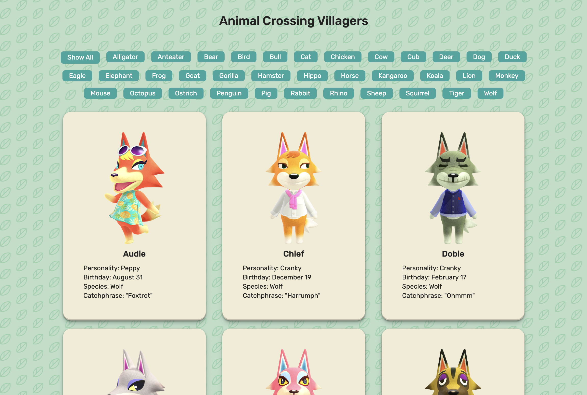

# Animal Crossing API Call

This is a simple project that makes GET requests to the [Nookpedia API](https://api.nookipedia.com/) to display villager data. Users can browse all villagers or filter for specific species of villager.

## Page Preview

## Tech Stack
- HTML, CSS and Javascript

## Attribution
[Nookpedia API](https://api.nookipedia.com/)

### Notes
If you're interested in creating your own project using this API, you can request an API key at [Nookpedia](https://api.nookipedia.com/).

